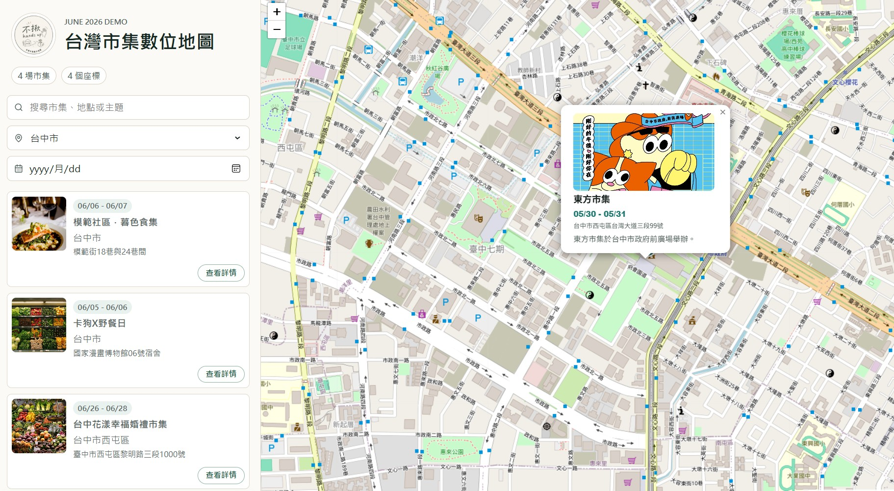
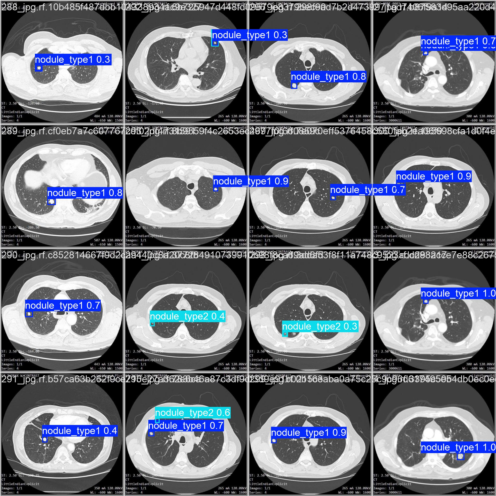

我是盧晉偉，這裡整理我在資料分析、電腦視覺、時間序列模型與 AI 應用開發上的作品與技術筆記。

## 精選作品

```{=html}
<div class="featured-grid">

<a class="featured-card" href="projects/amazon_product_reviews_alanysis/">
<div class="featured-card-visual visual-amazon"><span>Review Mining</span></div>
<div class="featured-card-body">
<p class="featured-card-kicker">NLP / LLM</p>
<h3>Amazon 評論分析</h3>
<p>把評論從情緒分類重新定義成 actionable review mining，結合 DistilBERT 與 Gemini 產出產品問題摘要。</p>
</div>
</a>

<a class="featured-card" href="projects/market_map/">

<div class="featured-card-body">
<p class="featured-card-kicker">React / LINE LIFF / FastAPI</p>
<h3>全台市集地圖平台</h3>
<p>串起市集探索、LINE 現場活動介面與主辦方營運數據，處理發現端與現場端的產品斷點。</p>
</div>
</a>

<a class="featured-card" href="projects/lung_nodule_detection/">

<div class="featured-card-body">
<p class="featured-card-kicker">Computer Vision / YOLO</p>
<h3>YOLO 肺結節偵測</h3>
<p>在小資料集與小目標限制下訓練 YOLOv11，分析模型大小、資料增強與醫療影像偵測指標的取捨。</p>
</div>
</a>

<a class="featured-card" href="projects/kalman/">
<div class="featured-card-visual visual-kalman"><span>Kalman Filter</span></div>
<div class="featured-card-body">
<p class="featured-card-kicker">Time Series / Quant</p>
<h3>Kalman Filter 配對交易</h3>
<p>以狀態空間模型建立配對交易價差估計流程，並討論模型在劇烈變動時的延遲限制。</p>
</div>
</a>

</div>
```
