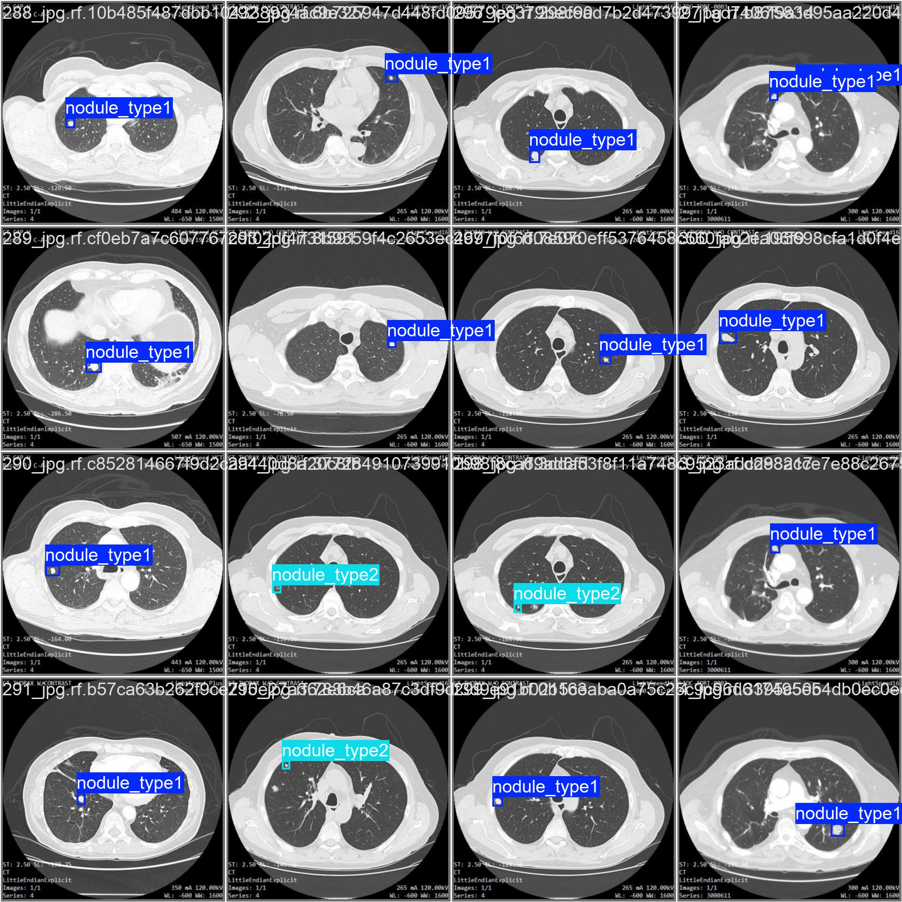

# 肺結節早期篩檢

肺結節偵測是肺癌早期篩檢的關鍵一步——能不能在小病灶長大之前先把它找出來，往往就是預後的差別。但這件事在技術上有兩個疊在一起的難點，讓它不只是「再訓練一個 YOLO」這麼簡單。

第一個難點是**目標太小**。結節依大小分兩類，其中 ≤3mm 的小結節在 416×416 的影像裡只佔幾個像素，經過偵測網路的下採樣之後，可能只剩下特徵圖上的一兩個格點。模型很難在這麼稀疏的資訊裡定位。

第二個難點是**資料又小又寬鬆**。整個資料集只有約 280 張影像（訓練 239、驗證 41），而且小結節的樣本數本來就少——驗證集裡的小結節只有 8 個。另外，這份資料集的標註框得相當寬鬆，沒有精準貼合腫瘤邊界。

所以真正的題目不是「偵測肺結節」，而是：**在小資料、小目標、寬鬆標註這三個限制同時存在時，怎麼把偵測效果逼到合理範圍？**

> 資料集：[Lung Nodules Detection Dataset](https://www.kaggle.com/datasets/younesselbrag/lung-nodules-detection-dataset-annotations/data)（Youness El Brag, Kaggle）
> 影像尺寸 416×416；兩類別 `nodule ≥3mm`、`nodule <3mm`；訓練 239 張、驗證 41 張。

---

## 針對「小目標」做的調整

### 把解析度放大

我把原圖從 416×416 插值放大到 1280×1280。放大並沒有增加任何影像資訊——插值出來的像素都是內插的。它真正改變的是 YOLO 偵測頭特徵圖的空間密度。

原本只佔幾個像素的小結節，在下採樣後可能對應不到幾個格點；放大之後，同一個結節能對應到更多特徵圖格點，模型就有更多空間線索去定位。換句話說，這是用「更密的特徵圖」去換「對小物件更容易對位」。

### 學習率排程與正則化，防止過擬合

小資料集最大的敵人是過擬合，所以訓練設定朝泛化能力調整：

- 初始學習率 `lr0=0.003`，最終衰減到初始的 1%（`lrf=0.01`）——前期穩定收斂，後期細修。
- 用 **AdamW** 搭配 `weight_decay=0.0005` 做正則化，壓制小資料集的過擬合傾向。

### 資料增強：在樣本稀少時硬擠出多樣性

既然樣本少，就讓每張影像在訓練時盡量「變多」：

- `mosaic=1.0`：拼接多張影像，增加場景多樣性。
- `mixup=0.2`：混合影像，提升泛化。
- `copy_paste=0.3`：複製貼上標註物件，直接增加結節出現的次數。
- `scale=0.5`：隨機縮放，適應不同大小的腫瘤。

---

## 小模型 Nano 效果最好

調整完之後，我把 YOLOv11 的四種大小（Large / Medium / Small / Nano）都跑了一輪來比較。直覺上，大模型容量更大、應該更強。結果剛好相反：

| Model          | Overall mAP50-95 | ≤3mm mAP50-95 | ≤3mm mAP75 |
| -------------- | ---------------- | ------------- | ---------- |
| 11l (Large)    | 47.8%            | 34.5%         | 41.9%      |
| 11m (Medium)   | 46.9%            | 32.4%         | 11.0%      |
| 11s (Small)    | 53.7%            | 40.5%         | 33.8%      |
| **11n (Nano)** | **65.4%**        | **57.5%**     | **56.8%**  |

大模型（11l、11m）整體 mAP50-95 只有 46%～48%，反而是最小的 **11n 拿到 65.4%**，而且在最難的小結節上從 11s 的 40.5% 一路拉到 57.5%。

合理的解釋是：**這個資料集太小，大模型的容量沒地方發揮，只會去記訓練集的雜訊，於是過擬合；小模型容量受限，反而被迫學到比較通用的特徵，泛化更好。** 這也呼應前面所有「防過擬合」的設定——在小資料的世界裡，「更大」常常不是「更好」，而選對模型大小，對小物件偵測的影響大到超乎預期。

---

## 單一指標陷阱

比較模型時還踩到一個值得記下來的坑。看上面的表格，11m 的小結節 **mAP75 異常地低，只有 11%**，乍看像是這個模型在小結節上整個崩掉。

但同一個 11m 的小結節 mAP50-95 是 32.4%，其實跟 11l 同級，並沒有特別差。問題出在驗證集的小結節**只有 8 個樣本**——只算 mAP75 這種單一 IOU 門檻的指標時，幾個樣本的浮動就會把數字甩得很大；而 mAP50-95 是多個 IOU 門檻的平均，相對穩定得多。

所以在這種小驗證集上，**單一指標的數字不能盡信，要看跨門檻的平均**，否則很容易因為一兩個樣本就對模型下錯結論。

---

## 實務上：寧可多抓，也別放過

選定 11n 之後，來看它的完整表現：

| Model    | Precision | Recall | mAP50 | mAP75 | mAP50-95 |
| -------- | --------- | ------ | ----- | ----- | -------- |
| YOLOv11n | 85.4%     | 89.7%  | 89.8% | 73.2% | 65.4%    |

分類別來看：

| Class | Instances | Precision | Recall | mAP50 | mAP75 | mAP50-95 |
| ----- | --------- | --------- | ------ | ----- | ----- | -------- |
| all   | 44        | 85.4%     | 89.7%  | 89.8% | 73.2% | 65.4%    |
| ≥3mm  | 36        | 94.3%     | 97.2%  | 98.2% | 89.5% | 73.2%    |
| ≤3mm  | 8         | 76.6%     | 82.1%  | 81.3% | 56.8% | 57.5%    |

在癌症早篩的情境下，最不想發生的事是**漏掉一個真的存在的病灶**，所以我偏好把 Recall 顧好——Recall 89.7% 代表所有真實存在的結節中，模型抓出了將近九成。

但這不是一味地疊高 Recall。Precision 仍維持在 85.4%，意思是模型標為結節的位置裡約 85% 確實是結節，誤報並沒有失控。在「不放過病灶」和「不要一直亂報」之間，這個模型站在一個我覺得對篩檢任務合理的位置。

### Detection Results

  
  

<em>Ground Truth（左）vs Prediction（右）</em>

---

## 限制與後續方向

這個模型在大結節上很穩（≥3mm 的 mAP50-95 有 73.2%），但**小結節依然是弱點**（57.5%）：

1. **標註寬鬆**。模型學不到高 IOU 的精準定位。這正是小結節 mAP50（81.3%）和 mAP75（56.8%）落差這麼大的原因——找得到大概位置，但框不準。
2. **樣本太少**。驗證集只有 8 個小結節，指標的標準差會變大。

還有一個細節值得記：在 11n 上，不論整體、大結節、小結節，Recall 都高於 Precision；而**小結節的 Recall（82.1%）和 Precision（76.6%）差距達 5.5 個百分點**，比整體（4.3）和大結節（2.9）都大。代表模型在小結節上「框錯」的情況相對更多，再次呼應了小結節難偵測、標註寬鬆、樣本少這幾件事。

目前我用 `copy_paste` 做的是全域增加樣本，後續比較對的方向應該是：

- **單獨補小結節的資料**，提高它的數量與佔比，而不是只靠全域增強。
- **嘗試能容忍寬鬆標註的訓練法**，讓模型不被不精準的框邊界綁死。

整體來說，這個模型在應用方向上是合理的，但小結節這塊我還沒解完——這也是我覺得這個專案最有意思的地方：它讓我看到在小資料的限制下，模型選擇、指標解讀、實務取捨各自該怎麼權衡，而不是把一個跑得動的 baseline 當成終點。