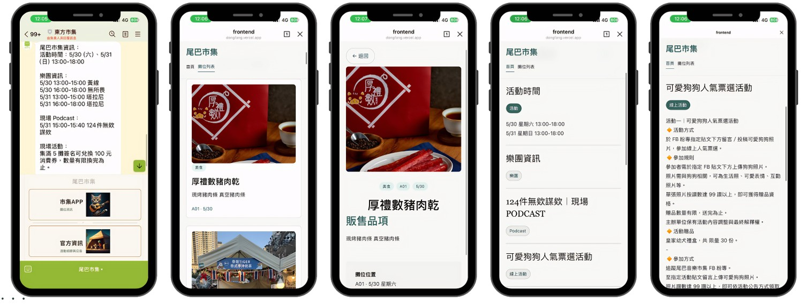
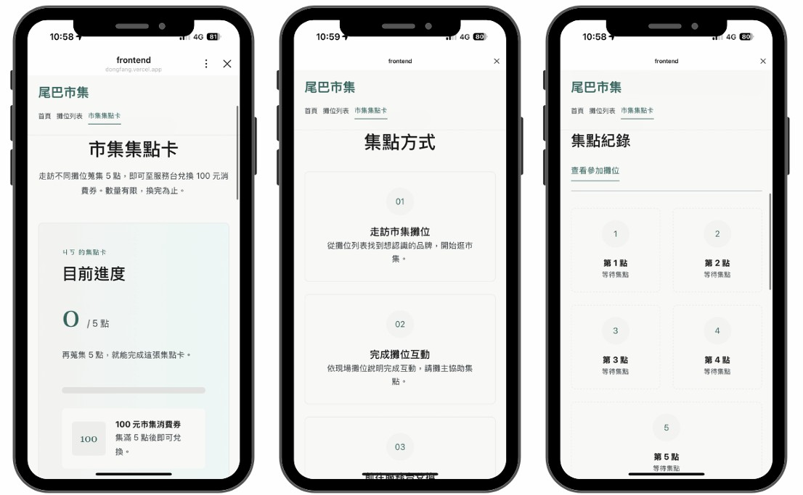

## 這個專案在解什麼

每到週末，全台有大量市集同時開張，資訊卻散落在 IG、粉專、活動社團和主辦方公告裡。對想出門逛市集的人來說，痛點其實很具體：不知道這週末附近有哪些市集、不知道有哪些攤、找到的時候活動常常已經結束。

而站在另一端的主辦方，問題更隱形：他們對自己的活動幾乎沒有任何數據。現場靠紙本集點卡——印多了浪費、印少了不夠、散場後一疊集不滿的卡只能丟，活動結束也說不清今天到底多少人真的參與。

所以這個專案要解的，是同一條斷裂的路徑上的兩個缺口：

1. **發現端**：讓「找市集」這件事，從翻十個社群變成看一張地圖。
2. **現場端**：讓某一個市集的現場資訊（活動、攤位、集點）變得好找、好用，並讓主辦方第一次握住自己的數據。

## 整體設計：兩層架構

我把整個系統拆成兩層，各自是一個可以獨立跑起來的專案：

- **發現層 — 全台市集地圖**
  一張全台市集地圖，負責回答「這週末哪裡有市集」。使用者在這裡瀏覽、搜尋、篩選、看點位，然後**選定一個想去的市集**。技術上是 `React + Leaflet` 的雙欄地圖介面，後端用 `FastAPI` 提供輕量查詢層。

- **現場層 — 個別市集活動 App（東方市集為例）**
  某一個市集自己的活動頁，負責回答「我已經決定去這個市集了，那它有哪些攤、哪些活動、集點還差幾點」。技術上是跑在 LINE 裡的 `LIFF` 前端，後端 `FastAPI` 串 `Supabase`，並記錄使用者互動事件給主辦方看。

兩層之間的交棒，不是「再開一個網站」，而是落在使用者本來就熟悉的入口——**LINE**。

```{mermaid}
%%{init: {
  "theme": "base",
  "flowchart": {
    "nodeSpacing": 50,
    "rankSpacing": 80,
    "diagramPadding": 20
  },
  "themeVariables": {
    "fontFamily": "Noto Sans TC, Microsoft JhengHei, sans-serif",
    "primaryColor": "#ffffff",
    "primaryTextColor": "#111827",
    "primaryBorderColor": "#334155",
    "lineColor": "#64748b",
    "secondaryColor": "#f8fafc",
    "tertiaryColor": "#ffffff"
  }
}}%%

flowchart LR
  user["使用者"]

  subgraph D["發現層：全台市集地圖"]
    direction TB
    map["React + Leaflet 地圖<br/>搜尋 / 篩選 / 看點位"]
    detail["市集詳情面板"]
  end

  subgraph BRIDGE["連接點"]
    direction TB
    oa["個別市集 LINE 官方帳號"]
    rich["Rich Menu"]
  end

  subgraph V["現場層：個別市集活動介面"]
    direction TB
    liff["LIFF App<br/>活動 / 攤位 / 集點卡"]
    dash["主辦方數據後台"]
  end

  user --> map
  map --> detail
  detail -->|官方 LINE 按鈕| oa
  oa --> rich
  rich --> liff
  liff --> dash

  classDef normal fill:#ffffff,stroke:#334155,color:#111827,stroke-width:1.5px;
  classDef bridge fill:#fff7ed,stroke:#ea580c,color:#111827,stroke-width:1.5px;
  classDef app fill:#ecfdf5,stroke:#059669,color:#111827,stroke-width:1.5px;
  classDef person fill:#eff6ff,stroke:#2563eb,color:#111827,stroke-width:1.5px;

  class map,detail normal;
  class oa,rich bridge;
  class liff,dash app;
  class user person;

  style D fill:#f8fafc,stroke:#94a3b8,color:#111827
  style BRIDGE fill:#fffaf0,stroke:#f97316,color:#111827
  style V fill:#f0fdf4,stroke:#10b981,color:#111827
```
## 連接點：從平台詳情走進個別市集的 LINE

整個系統最重要的設計，就是這條交棒路徑：

> 在全台地圖上選定一個市集 → 從它的詳情頁打開**那個市集自己的 LINE 官方帳號** → 從官方帳號的 rich menu 進入該市集的 LIFF App。

刻意不在發現層裡「內建」每個市集的完整現場功能，而是把使用者交棒到各市集自己的 LINE，是因為這樣每一層的職責都很乾淨：發現層只負責把人帶到對的市集門口，現場層由各市集自己的官方帳號接手。對使用者來說，全程都在 LINE 裡，不需要下載任何 App。

### 第一步：發現層詳情頁的官方 LINE 按鈕

在全台地圖的市集詳情面板裡，只要該市集有設定 LINE 連結，就會顯示一顆官方 LINE 按鈕。這顆按鈕就是交棒的起點——使用者點下去，就離開「綜覽地圖」，走進「某一個市集」。

發現層的後端同時也放了 LINE webhook 的雛形，可以用文字指令完成同一件事：輸入「市集地圖」回覆地圖入口，輸入特定市集名稱（例如「東方市集」）則回覆**那個市集指定的官方 LINE 連結**。換句話說，無論使用者是在網頁上看地圖、還是在 LINE 裡跟平台對話，都能被導向同一個出口。

```python
# 發現層 webhook：把使用者導向「某個市集自己的官方 LINE」
def handle_text_message(text: str) -> str:
    if text == "市集地圖":
        return LIFF_MAP_URL  # 回到全台地圖
    if text in MARKET_LINE_LINKS:
        return MARKET_LINE_LINKS[text]  # 交棒給該市集的官方帳號
    return DEFAULT_REPLY
```

<p align="center">
  
  
</p>
<p align="center">
  <em>市集活動詳情頁（左）與全台市集數位地圖（右）</em>
</p>

### 第二步：個別市集官方帳號的 rich menu

使用者進到某個市集的官方帳號後，現場層接手。這個市集自己的 rich menu 切成兩塊：上半部走 LIFF，打開完整的活動頁；下半部走 bot 回覆，快速給出活動時間與公告。

```text
rich menu 上半部 → 開啟 LIFF（?source=rich_menu）
rich menu 下半部 → postback → webhook 回覆官方市集資訊
```

這個切分讓同一張 rich menu 同時支援「進入完整體驗」和「只想快速看一眼答案」兩種人。


<p align="center">
  
</p>
<p align="center">
  <em>LINE官方號入口 rich menu （左一） / 攤位列表（左二、左三） / 首頁資訊（右一、右二）</em>
</p>

### 第三步：LIFF App 接手現場體驗

LIFF 前端初始化後取得 LINE profile，拿到 `userId` 就能查這個人在這個市集的集點進度。使用者可以看活動、依日期與分類篩攤位、看攤位詳情，每一步互動都會被記成事件寫回 Supabase——這正是讓主辦方第一次有數據可看的地方。

```tsx
await liff.init({ liffId });

if (!liff.isLoggedIn()) {
  liff.login();
  return;
}

const profile = await liff.getProfile();
// 之後就能用 profile.userId 查這個人在此市集的集點進度
```

到這裡，使用者就完成了從「在全台地圖上隨意逛」到「站在某個市集裡、手上拿著手機找攤」的完整移動，而且全程沒有離開 LINE。

<p align="center">
  
</p>

<p align="center">
  <em>數位集點卡</em>
</p>

## 兩個子專案的技術重點

兩層各自的實作細節我寫在獨立的文章裡，這裡只點出重點與分工。

| | 發現層：全台市集地圖 | 現場層：個別市集 App |
|---|---|---|
| 要回答的問題 | 這週末哪裡有市集 | 這個市集有哪些攤、哪些活動、集點 |
| 前端 | React + react-leaflet（雙欄地圖） | React + LINE LIFF SDK |
| 後端 | FastAPI（讀 JSON 的輕量查詢層） | FastAPI（串 Supabase + webhook） |
| 資料層 | Excel 轉 mock JSON（第一版） | Supabase Postgres |
| LINE 角色 | webhook 導向各市集官方帳號 | rich menu + LIFF + 集點 + 行為分析 |
| 主要產出 | 可探索的全台市集地圖 | 可營運、可分析的單一市集現場系統 |

## 為什麼整條路徑都壓在 LINE 上

這套設計刻意不開獨立 App，而是把發現、交棒、現場體驗全部放進 LINE。這不是技術上做不到，而是針對使用情境的取捨：

- **現場掃碼的那一秒，才是真正的轉換關卡。** 任何「請先下載 App」的步驟，在市集現場都會變成當下的流失點。LINE 已經在使用者手機裡，少了這層摩擦。
- **兩層之間的交棒因此可以無縫。** 因為發現層和現場層共用同一個 LINE 入口，使用者從地圖走進某個市集時，不會經歷「跳出去、再下載、再登入」的斷裂。
- **軟體優先是刻意的結構選擇，不是省略。** 不做攤商端硬體裝置，讓每多接一個主辦方就能解鎖背後數十個攤商，整套系統靠軟體就能擴張——這是把「可規模化」放在第一順位的設計判斷。

## 現況：東方市集落地驗證

這套兩層架構不是純構想。發現層與現場層的基建，已經透過與「東方市集」的合作做過一次真實驗證，驗證了兩件事：

1. **LINE 基礎建設在真實市集跑得動。** 為東方市集完成了 LINE 官方帳號、LIFF 頁面，以及市集資訊頁、攤位列表與攤位介紹的上線。一個沒有技術背景的主辦方能順利導入，消費者免下載就能在 LINE 裡瀏覽。
2. **集點卡數位化的需求是真實而強烈的。** 現場親眼看到紙本集點卡發放沒有控管、印量難拿捏、散場後無從得知參與人數的混亂，並向其他主辦方確認這是市集產業的共通痛點。

需要精確區分的是：這次合作**驗證了基建、確認了集點卡的需求**，但數位集點卡這個功能本身**還沒有在東方市集實際部署**。把這條界線講清楚，比把它寫成「集點卡已上線」更站得住腳。

## 下一步

從兩層各自的限制，下一步其實很明確：

1. **發現層接資料庫與 geocoding**：把第一版的 Excel 轉 JSON 換成 PostgreSQL + PostGIS，並讓地址批次轉座標、標記信心分數。
2. **現場層補上集點寫入流程**：讓攤主或服務台能掃碼或輸入代碼，更新使用者的集點進度——把「需求被確認」推進到「功能實際上線」。
3. **把交棒做得更順**：用 Rich Menu 與 LIFF 入口取代文字指令，讓使用者不必記「輸入市集地圖」這種命令。
4. **數據後台**：整理 rich menu 開啟率、熱門攤位、搜尋關鍵字與日期偏好，讓主辦方真正看得到自己的活動成效。
5. **權限控管**：為主辦方的管理操作加入角色與登入驗證。

## 小結

這個專案有趣的地方，不在單一技術堆疊多複雜，而在於它把一條本來斷裂的日常路徑重新接了起來：

> 在全台地圖上發現市集 → 從詳情頁走進那個市集的 LINE 官方帳號 → 在 LIFF 裡逛攤、集點 → 主辦方拿回自己的數據。

發現層回答「去哪裡」，現場層回答「到了之後怎麼逛」，而兩者之間的交棒刻意壓在 LINE 上，讓整段體驗不需要使用者下載任何東西。對活動、店家、地方社群這類產品來說，「先把資訊變得可探索、再無縫交棒到熟悉的入口」，往往就是產品真正開始長出來的地方。
